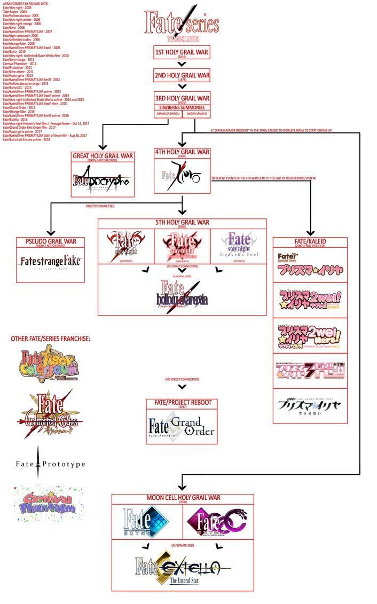

# Miru Docs

## Overview
This app manages all things related to anime on the arcadia platform from displaying anime details to handling a users anime list

## Models
The anime model is one of the most intricate models in Arcadia, and is structure in a way to adhere to what I call "The Fate Case"

### The Fate Case
Upon internal discussion, it was deemed the Fate anime franchise would be a perfect test case to see if the Arcadia Anime Model was worthy and scalable to handle all sorts of anime relationship scenarios.
 
Thanks to KuroShiniKami on DeviantArt for the rough diagram to test.
From this diagram, there were 3 major hurdles to overcome. 
    1 - Multiple animes could stem from a single anime (Fate/Zero branches into 3 anime paths -> Ulimited Blade Works, Heavens Feel, Fate/Stay Night) 
    2 - There could be side series that aren't necesarilly part of the main timeline. (Fate/Kaleid Liner Prisma is a 'alternate timeline' to the Fate/Zero story) 
    3 - There are multiple type of side series (specials, ova, ona, alternate timelines)

To view the anime model, view [models/anime.py](models/anime.py)

## Data
For the sake of obtaining accurate and pleantiful data, enough to properly showcase the Miru app in its full capacity, Arcadia connects with the Anilist Graphql API. As the structure for anime details differs between Arcadia and Anilist, I developed a script to convert the anilist json repsonse into the appropriate Arcadia models and create the relations. You can view the script and its modules [here](anilist)

## API
The Miru app mainly utilizes graphql for its ability to specificly request what information the platform needs of an anime.
